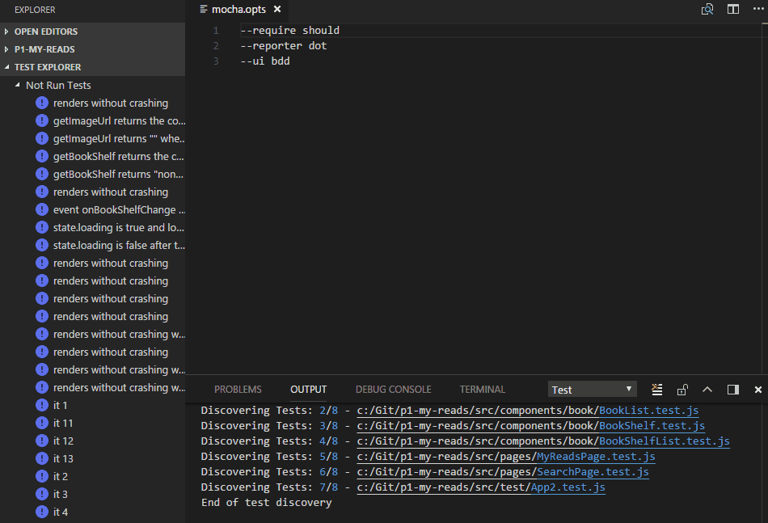
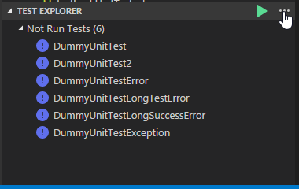
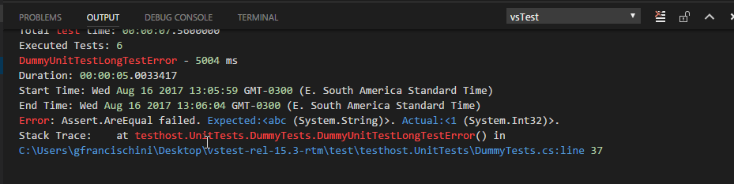

# Visual Studio Code Unit Test Tree View for JS

Download [Visual Studio Marketplace](https://marketplace.visualstudio.com/items?itemName=gfrancischini.vscode-unit-test)

## Sections

[List of Features](##Features)<br>
[How to Configure](##Extension-Settings)
[Build](##Build)
[Contribution](##Contribute)

## Quick Overview

Discover tests, Run specific tests, Inspect results, Debug, Open test location.



## Features

### Run tests in Test Explorer

When the extension is enabled it will automatically open the Test Explorer. All tests that have been discovered will show on the Test Explorer just like on the image below



As you run, write, and rerun your tests, Test Explorer displays the results in default groups depending upon your selected group by filter.
### Group By - Group Test by Outcome, Duration or File

* Outcome - Tests are grouped by - **Failed Tests**, **Passed Tests** and **Skipped Tests**
* Duration - Tests are grouped by - **Slow**, **Medium** and **Fast**
* File - Tests are grouped by **File Name**

### Run tests / Debug Tests
You can run all the tests in the solution, all the tests in a group, or a set of tests that you select. Do one of the following:

* To run all the tests in a solution, click on the **...** and choose **Run All** or **Debug All**.
* To run a specific test right click the test and select **Run Selected Test** or **Debug Selected Test**
* To run a specific group of test right click the test group and select **Run Selected Test** or **Debug Selected Test**

### View test results

As you run, write, and rerun your tests, Test Explorer is automatically updated and displays the results using color code icons. To view more details about the test just click on the test and the **Test Result** output pane will open showing the test results.

**Show Selected Test Results**


The result will be displayed on the **output window**



### View the source code of a test method
To display the source code for a test method in the Visual Studio Code editor you only need to left click the test. 


## Requirements

NodeJS > 6.0 for Running Mocha Tests

## Extension Settings

This extension contributes the following settings:

```
"unit.test.mocha" : {
    "glob": "test/**/*.js",
    "opts": "/Test/mocha.opts",
}
```

* `glob`: Optional Mocha Glob pattern used to find test files. By default the extension will use the glob pattern "test/**/*.js"
* `opts`: Optional Mocha Opts Path Relative path to the workspace. By default the extension will search for mocha.opts under you test directory
* `mochaPath` : Optional Mocha relative or full path to the installed mocha module. By default the extension will search the node_modules of you project

## Known Issues

Calling out known issues can help limit users opening duplicate issues against your extension.

## Release Notes

### 0.2.1
Fix bug when  retrieving the default settings of the mocha provider

### 0.2.0
Improve debug protocol
Add command Debug All

### 0.1.0
Major changes in the protocol to exchange information between server and client
Now the mocha provider is almost a fully extension plugin
Configuration of the plugin is now handled by each extension.
Bug fixes

### 0.0.4 AND 0.0.3

Release bug fixes (package missing)

### 0.0.2

Add missing skipped tests to the outcome group by view 
Perfomance improvements
Improve how test cases run are handled (join test cases that are from the same file)
Implement run all tests command
Fix grep calculation bug
Fix mochatestfinder bugs
Cleanup

### 0.0.1

Beta Initial release 


-----------------------------------------------------------------------------------------------------------

## Contribute

Interested in contributing to this project? Check out below the ways to contribute and make this project better.

* Submit a bug report or feature suggestion through the GitHub Issue Tracker
* Review the source code changes
* Submit a code fix for a bug


## Build
To build the extension, run the following command from the root of the repository:

`npm build`

This command will create the out\src and out\test folders at the root of the repository.